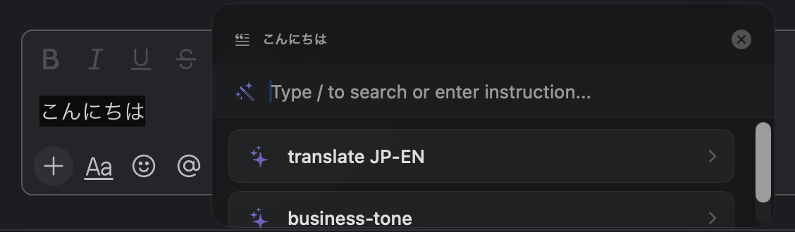

# inlina



A macOS menu bar app for instant AI-powered text editing. Select text in any app, press a shortcut, and edit with AI — right where you're working.

## Features

- **Works in any app** — select text → press shortcut → AI edits it in place
- **Multiple AI providers** — OpenAI / Anthropic / Google Gemini with custom base URL support
- **Custom prompts** — create your own AI actions with personalized instructions
- **Slash search** — type `/` to quickly filter and find custom prompts
- **Floating panel UI** — appears near your cursor, dismiss with Escape
- **Clipboard preservation** — restores original clipboard after text replacement

## Requirements

- macOS 14.0 (Sonoma) or later
- Swift 5.9+
- Xcode Command Line Tools

## Installation

```bash
# Build
./build-app.sh

# Copy to Applications
cp -R inlina.app /Applications/
```

On first launch, grant **Accessibility permission** in System Settings → Privacy & Security → Accessibility.

## Usage

1. Launch inlina from the menu bar
2. Open **Settings** (⌘,) and configure your AI provider and API key
3. Set a **keyboard shortcut** in Settings → Shortcuts
4. Select text in any app → press your shortcut
5. Choose an action or type a custom instruction in the floating panel
6. Click **Replace** to insert the result, or **Copy** to copy it

## AI Providers

| Provider | Default Model | Custom Base URL |
|----------|---------------|-----------------|
| OpenAI | gpt-4o | Supported |
| Anthropic | claude-sonnet-4-20250514 | Supported |
| Google Gemini | gemini-pro | Supported |

Custom base URLs let you use Azure OpenAI, local LLMs, or any compatible endpoint.

## Project Structure

```
inlina/
├── InlinaApp.swift          # App entry point, accessibility API, text capture
├── AIService.swift          # AI API communication
├── FloatingPanel.swift      # Window management
├── FloatingPanelView.swift  # Floating panel UI
├── SettingsView.swift       # Settings UI
├── SettingsStore.swift      # Settings persistence
├── AIAction.swift           # Built-in AI action definitions
└── ...
```

## Dependencies

- [KeyboardShortcuts](https://github.com/sindresorhus/KeyboardShortcuts) — global shortcut recording
- [HotKey](https://github.com/soffes/HotKey) — global hotkey handling

## License

MIT
